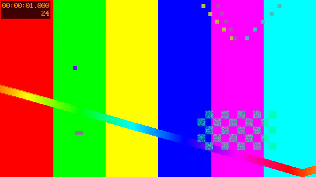
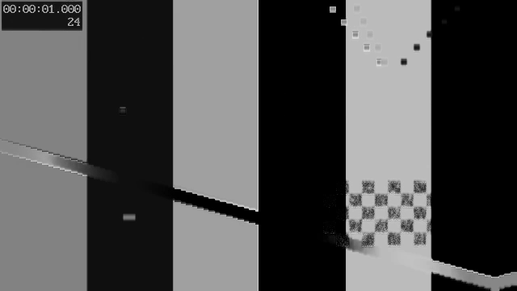
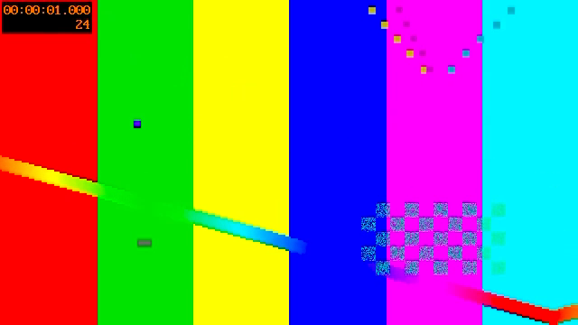

# Local workflow and replacement assessment — 2026-09-07

**Recommendation: keep the experiment inactive. Use an established editor for
creator work, and preserve this repository as a small local effects and variant
comparison engine.** The native pipeline works, but a recurring creator benefit
has not been demonstrated. Building broad editor parity would exceed the
bounded deterministic-effects purpose.

## What actually ran

Source implementation: `f6855dda942e1983cdeb989414468631d280eb55`.
The checkout was clean before this audit. No production code, dependencies,
models, signing configuration, or deployed surface changed.

An original six-second, silent, 640×360/24 fps moving test pattern was generated
with the already installed FFmpeg solely as QA input. The application itself
continues to have **zero external Swift packages** and renders with
AVFoundation/Core Image. No private footage, synthetic speech, upload, paid
service, model download, or provider publication was involved.

1. Discovered `studio-agent manifest` and `catalog`, then analyzed the source.
2. Requested two noir/cinematic variants. The already available Apple Foundation
   Models planner returned `plannerKind: local_model`,
   `planner: apple-foundation-model`, and `fallbackReason: null`.
3. Split the first graph at three seconds and removed its second effect
   interval. These are graph operations; this is not general multi-clip editing.
4. Ran `validateOnly: true` before each final render. Both native renders
   completed with no degradations for these selected effects.
5. Wrote a documented `StudioProject` JSON from actual analysis, graphs, and
   render manifests; loaded it using `inspect`; validated and selected the noir
   variant; validated and exported it using the existing agent.
6. Deliberately made a separate project revision stale. Export validation failed
   with `EXPORT_NOT_READY`, and no output was created.

The helper used the built `studio-agent` binary with request files. An initial
XcodeBuildMCP invocation incorrectly supplied inline JSON to `--request`, which
expects a **file path**; the corrected request-file invocation succeeded. This
was an invocation error, not a product build failure.

## Retained evidence

[Structured receipt](../artifacts/qualification-2026-09-07/receipt.json) includes
the exact planned graphs, edited graph/hash, native render manifests, source
recipe/hash, export hash, and playback results. Generated media and detailed
operation request/results are local-only under
`.fleet-local/shareability-2026-09-07/`.

| Artifact | Result |
| --- | --- |
| `synthetic-source.mp4` | 6 seconds, 640×360, H.264, 144 frames, no audio |
| `variant-1.mp4` | Edited noir graph, 3 seconds, 72 frames |
| `variant-2.mp4` | Cinematic graph, 6 seconds, 144 frames |
| `selected-export.mp4` | Exact copy of selected current noir render, 424,928 bytes |
| Full FFmpeg decode | All four files passed |
| Isolated Chrome playback | 3-second export advanced to 1.200414 seconds, 38 decoded frames, ready state 4, no error |
| Visual inspection | Source, noir, and cinematic frames at one second inspected; whole frame and timestamp visible, expected color differences |

Selected export SHA-256:
`a5389a263db2c662c15c976b26ea87afb59d896839181ba2d4e8b9b6ccfe7c1a`.

The test pattern makes color changes easy to inspect. It is an engineering
fixture, not a finished creator video or an aesthetic recommendation. No audio,
human SwiftUI interaction, synchronized UI comparison, public installation, or
real creator outcome is claimed. The isolated browser profile was removed after
playback. No server remains running.

## Capability gaps that affect the decision

The catalog lists 23 effects, but the renderer is narrower. Review of
`AVFoundationRenderer.swift` and `GraphCompiler.swift` found:

- Captions and title overlays are retained in graphs but not rendered; manifests
  disclose degradation. Auto-subject framing uses center crop. Background
  replacement retains the original background.
- Crossfade compiles to a transition operation, but the renderer does not apply
  that operation. `audio.normalize` sets gain to 1; it does not measure or
  normalize loudness. Both currently have overly broad `ready` catalog labels.
- Background blur processes the full frame, and outline/glow are image filters,
  not segmented-subject effects. Beat flash/zoom use periodic time functions,
  not detected beats. Eight style effects are explicitly approximations.
- Timeline segments define effect activation and the final graph end bounds
  source duration. Removing a middle interval does not assemble a multi-clip
  cut. The current speed path applies the first speed value to the composition.

Only noir/cinematic rendering was runtime-qualified here. The other findings
are source evidence, not completed behavioral tests. These gaps remain visible
in the README; implementing a full editor would exceed
this held experiment’s bounded repair-and-assess scope.

## Replace rather than expand

Official product pages checked on 2026-09-07; these are vendor-documented
capabilities, **not** hands-on qualifications on this Mac.

| Choice | Practical fit | Limit of this assessment |
| --- | --- | --- |
| [DaVinci Resolve](https://www.blackmagicdesign.com/products/davinciresolve) | Default candidate for actual editing, color, effects, and audio. Its free version covers ordinary 8-bit footage up to UHD/60 fps; additional AI features are in Studio. | No install or comparative creator task performed. |
| [Final Cut Pro](https://www.apple.com/final-cut-pro/) | Mac-focused alternative with a full timeline, captions, tracking and masking. Prefer evaluating this if Mac workflow simplicity is more valuable than cross-platform use. | No license purchased or hands-on comparison performed. |
| [ChatCut](https://chatcut.io/) | The closest candidate to issue #33's prompt-driven editing, transcript cuts, captions, motion graphics, and agent integration. | Its site does not establish this project's strict offline/local-processing contract. Use only permitted synthetic or public media until data handling is verified. No plugin installed or media uploaded. |
| This repository | Finite, inspectable effect graphs; local native rendering; reproducible variant selection and export. | No established recurring creator job, incomplete effects, no supported public installation. |

The useful differentiator is a bounded local comparison workflow with explicit
graphs and provenance. That is worth preserving; it does not presently justify
maintaining a second general-purpose editor. Before reopening feature work,
compare one real permitted creator job in an existing editor with the same job
here: time to acceptable export, corrections needed, repeatability, and privacy
requirements. Resume only if this tool wins a recurring requirement that the
existing editor cannot meet sufficiently.

## Checks and tasks

`node scripts/check-code-health.mjs all` passed locally: **71 tests**, full Swift
build, zero formatter/Periphery/suppression findings, complexity and duplication
within existing ceilings, zero external Swift dependencies, repository hygiene,
and static site checks. Measured library coverage: 88.2658% lines, 89.2720%
functions, 80.8883% regions. Documentation corrected its obsolete 43-test count;
no code change caused these pre-existing metrics to improve in this audit.

GitHub reconciliation: **1 open issue (#33), 0 open PRs, 0 closures**. The ChatCut
capability request remains unmet and retained. Issue #16 is already closed
historical cleanup context, not a current task. Public distribution still needs
an approved support channel and a Developer ID signed, notarized, stapled,
Gatekeeper-accepted package. This local export closes none of those gates.
