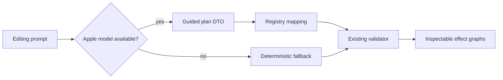

# Design: Apple Foundation Models planner

## Approach

`PreferredVariantPlanner` checks `SystemLanguageModel.default.availability`.
When available, `AppleFoundationPlanner` asks a `LanguageModelSession` for a
small `@Generable` plan DTO. The DTO uses only strings, bounded numbers, and
arrays; an adapter maps accepted effect identifiers into `EffectGraph` values.
The existing validator remains the authority for parameters, compatibility,
normalization, cost, and hashes.

## Safety and failure behavior

- The model receives prompt text, duration, output profile, variant count, and
  the supported-effect catalog—not source video frames or paths.
- Unknown effects, invalid parameter combinations, and malformed plans are
  rejected before rendering.
- Model unavailability or generation failure falls back once to the
  deterministic planner with a visible reason.
- No shell commands, tools, network calls, or arbitrary code are available to
  the model session.

## Compatibility

Foundation Models APIs are guarded by `#if canImport(FoundationModels)` and
`@available(macOS 26.0, *)`. Older systems continue to build and use the
deterministic planner.

