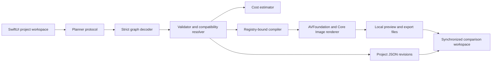

## Context

This is a new local macOS project with no shipped code. See `proposal.md` for
motivation and the four capability specs for observable behavior. The first
implementation must prove graph safety, reproducibility, batch state, and the
comparison loop using only Apple system frameworks; heavyweight model runtimes
and external media binaries need separate dependency and licensing decisions.

## Goals / Non-Goals

**Goals:**

- Keep planning, validation, rendering, comparison, and persistence separable
  and testable without launching the app UI.
- Deliver a real AVFoundation/Core Image draft renderer for a bounded set of
  deterministic operations and honest stylized approximations.
- Make every output traceable to a normalized graph and source fingerprint.
- Keep the renderer responsive, cancellable, and resilient to one effect or
  one variant failing.

**Non-Goals:**

- Claiming production anime/comic neural fidelity before a model-backed adapter
  and its performance are proven on representative Apple Silicon hardware.
- Bundling model weights, FFmpeg, llama.cpp, MLX, ONNX Runtime, OpenCV, or a
  database in the initial slice.
- Supporting arbitrary timelines, compositing, plugins, cloud work, or direct
  publishing.

## Decisions

### Use a Swift package as the initial native app container

The project will use Swift 6 with a macOS executable target plus library and
test targets. This keeps the graph core and renderer independently testable and
lets contributors build with `swift build` before an Xcode project is needed.
SwiftUI owns the application shell; AVKit/AVFoundation own playback and media
I/O. An Xcode project can be introduced later for signing, entitlements, and
distribution.

Alternative considered: start with a generated Xcode project. That adds opaque
project-file churn before signing or App Store packaging is in scope.

### Organize around pure contracts and registered adapters

`StudioCore` will own Codable project models, schema validation, effect
registry, compatibility rules, estimates, and planning protocols. `MediaEngine`
will compile normalized graphs into registered operations. `StudioApp` will
coordinate document state and UI. The UI never sends raw planner output to a
renderer.

Alternative considered: encode behavior in a flexible node/plugin system.
That expands the attack and compatibility surface and conflicts with the MVP's
fixed preset library.

### Make the schema closed, versioned, and canonicalized

Graph JSON uses explicit enums and typed payloads, rejects unknown keys, and
normalizes timeline order, output profile, defaults, and registered conflict
resolution before hashing. Each revision keeps raw intent separately from the
canonical graph. Stable IDs and hashes derive from canonical encoded data, not
user-facing labels.

Alternative considered: accept generic effect dictionaries and validate them
late. That makes exhaustive safety checks, migrations, and deterministic tests
substantially weaker.

### Start with a deterministic demo planner behind a local-planner protocol

The app will ship fixture-backed intent recognition for the milestone request
and explicit preset controls. A future local-LLM adapter must return schema
JSON through the same protocol and pass the identical strict decoder and
validator. The deterministic planner is labeled as such in project provenance.

Alternative considered: bundle a local LLM immediately. Model size, license,
hardware fit, prompt reliability, and download UX are unresolved dependencies;
none is required to prove the harder graph/runtime/comparison contract.

### Render bounded effects with AVFoundation and Core Image first

The initial compiler will cover timeline trim, aspect-fit/fill crop, speed,
text overlays, Core Image color/preset treatments, simple opacity transitions,
and audio mix normalization where supported. Anime, comic, noir, cinematic,
sketch, watercolor, cel, and VHS names initially map to documented,
deterministic filter recipes and are labeled “realtime approximation.” Expensive
future neural implementations replace only their registry adapters.

Alternative considered: shell out to FFmpeg. That complicates sandboxing,
distribution, subprocess safety, and dependency approval while adding little to
the core proof.

### Store portable JSON beside user-controlled media outputs

A project document stores relative references where possible, content
fingerprints, graph revisions, comparison state, and render manifests. Media is
not copied by default. Writes use temporary sibling files followed by atomic
replacement; outputs become visible only after completion. SQLite is deferred
because a single-user document does not yet need indexed relational queries.

### Use an actor-based render coordinator

One coordinator owns task state and limits initial render concurrency to one to
avoid unified-memory pressure. Each variant has its own state machine and
cancellation token. Completed variants become playable immediately; failures
do not cancel siblings. Preview defaults to 720p and may reduce resolution for
high-cost recipes.

### Gate visual implementation on direction selection

This net-new UI is an `overhaul` lane. Before SwiftUI screens are built, the
design workflow must record 2–3 named references and anti-references, produce
three materially different direction probes for the media workspace, and obtain
owner approval or explicit delegation. The selected direction updates root
`DESIGN.md`; final review will adapt the evidence widths to macOS window sizes
where browser-only capture is inapplicable and record that exception.

## Risks / Trade-offs

- [Filter recipes may not satisfy expectations attached to “anime” or “comic”]
  → Label them as approximations, show the exact recipe, and keep preset adapters
  replaceable without changing graphs.
- [AVFoundation export composition can become costly or brittle across codecs]
  → Normalize supported input diagnostics, start with H.264 draft export, use
  fixture clips, and isolate failures per variant.
- [Synchronized players can drift] → Drive all players from one coordinator,
  periodically measure time deltas, and surface unsynchronized state rather
  than hiding it.
- [Source bookmarks and moved files complicate reopening] → Persist
  security-scoped bookmarks where available plus fingerprints, and provide a
  relink flow without silently accepting a different source.
- [Performance targets depend strongly on hardware and effects] → Report work
  classes, instrument stage durations locally, keep targets as measured
  acceptance criteria, and avoid fabricated time estimates.
- [SwiftPM app packaging is not a distribution solution] → Treat the first
  milestone as a developer-runnable product; add signing and packaging only
  after the workflow proves compelling.

## Migration Plan

There is no existing user data or deployment to migrate. Schema version 1 will
ship with explicit decoding and migration boundaries; during development,
incompatible fixtures can be regenerated. Rollback consists of opening the
previous app build against its supported project version without rewriting the
source media or completed exports.

## Open Questions

- Which production model and license should replace each stylized approximation
  after benchmark fixtures and acceptable download size are agreed?
- Should signed distribution use a conventional Xcode project or generated
  project tooling once the developer demo is accepted?
