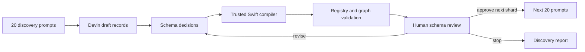

# Design: Planner schema-discovery pilot

Teacher output is untrusted and intentionally small. Devin decides whether to
plan, clarify, or reject; supported plans contain only labels, output intent,
registered effects, and meaningful parameters. A trusted Swift compiler owns
UUIDs, schema versions, exact dimensions and frame rates, provenance, timeline
defaults, and canonical validation. Validator success is not treated as proof
that the creative plan is useful.

The pilot contains 20 deliberately varied cases and ends under this change.
There are no train, validation, or sealed-test splits at this stage. Additional
gap-directed shards require a separately approved change.

Every record retains teacher, model, prompt version, generation timestamp,
semantic-plan version, compiler version, validator version, raw response,
compiled graph, validation findings, and human disposition. Failed raw attempts
remain immutable even when a later compiler produces an accepted graph.

The 25,000-example run remains out of scope until a separate gate confirms a
frozen schema v1, stable effect taxonomy and parameter domains, agreed timeline
semantics, resolved ambiguity behavior, and an accepted evaluation rubric.
